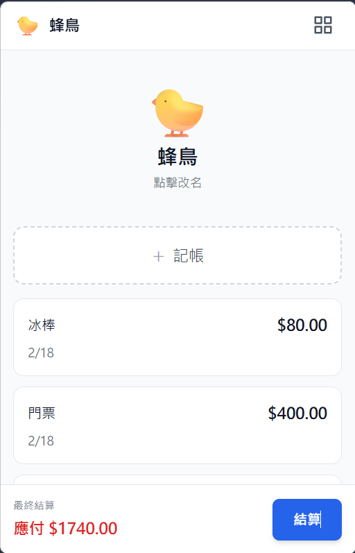
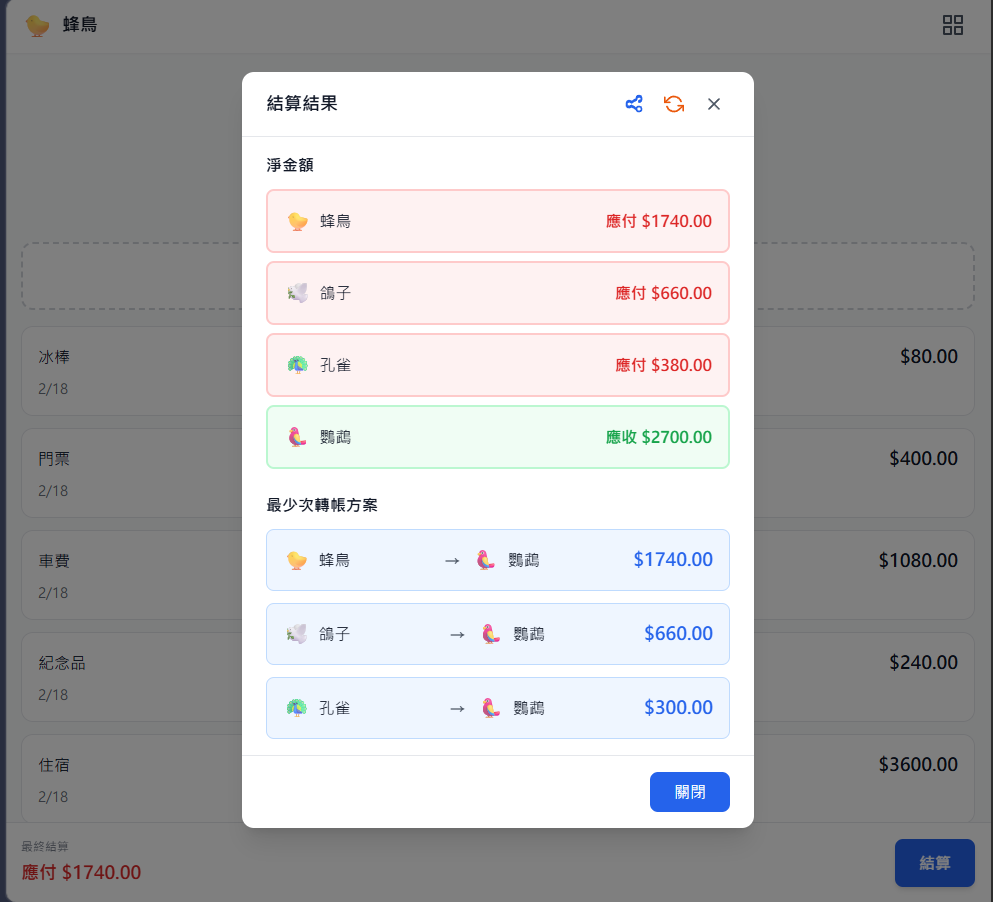

# 分帳應用 - Let's Go Dutch

一個行動裝置友善的分帳應用，支援多人分帳、彈性調整、智慧結算和最少轉帳次數優化。

## 預覽

| | |
|:---:|:---:|
|  |  |

## 技術棧

- **建置工具**: Vite
- **框架**: Vue 3 + TypeScript
- **樣式**: Tailwind CSS
- **狀態管理**: Pinia
- **壓縮函式庫**: pako (用於分享功能)

## 功能特色

- ✅ 人員管理（新增、刪除、重新命名，使用鳥類名稱和emoji）
- ✅ Header顯示目前人員 + 快速存取人員網格
- ✅ 人員網格檢視（快速跳轉和新增）
- ✅ 分帳記錄管理（支援多人付款、消費日期編輯）
- ✅ 總金額自動計算（從付款人金額總和）
- ✅ 分帳金額自動平均分配（總金額變化或分帳人員變動時）
- ✅ 分帳金額微調
- ✅ 結算計算（支援多人付款）
- ✅ 底部結算欄顯示目前人員淨金額
- ✅ 明細列表功能（列出所有已登記帳目，清晰展示多人合付情況）
- ✅ 最少轉帳次數演算法
- ✅ 已私下付款標記
- ✅ 帳目刪除功能
- ✅ 重置功能（清空帳目並恢復預設人員）
- ✅ 分享功能（URL參數壓縮分享，一鍵產生分享連結）

## 專案結構

```
lets-go-dutch/
├── src/
│   ├── components/          # 元件
│   │   ├── Person/          # 人員相關元件
│   │   ├── Expense/         # 分帳相關元件
│   │   │   └── ExpenseListModal.vue  # 明細列表彈窗
│   │   ├── Settlement/      # 結算相關元件
│   │   ├── Common/          # 通用元件
│   │   │   └── ShareModal.vue  # 分享彈窗
│   │   └── Layout/          # 版面配置元件
│   ├── views/               # 頁面檢視
│   ├── composables/         # 組合式函式
│   │   ├── useShareModal.ts  # 分享功能
│   │   └── usePersonUtils.ts # 人員工具函式
│   ├── utils/               # 工具函式
│   │   ├── algorithms.ts    # 核心演算法
│   │   ├── animalNames.ts   # 隨機鳥類名稱
│   │   └── shareEncoder.ts  # 分享編碼/解碼工具
│   ├── stores/              # 狀態管理（Pinia）
│   ├── types/               # TypeScript 型別
│   ├── App.vue
│   ├── main.ts
│   └── style.css
├── package.json
└── vite.config.ts
```

## 開發

### 安裝相依套件

```bash
npm install
```

### 啟動開發伺服器

```bash
npm run dev
```

### 建置正式版本

```bash
npm run build
```

### 預覽正式建置

```bash
npm run preview
```

## 設計文件

- [doc/DESIGN.md](./doc/DESIGN.md) - 完整設計企劃書
- [doc/ALGORITHMS.md](./doc/ALGORITHMS.md) - 核心演算法詳細說明
- [doc/HEADER_DESIGN.md](./doc/HEADER_DESIGN.md) - Header和人員網格檢視設計
- [doc/SHARE_DESIGN.md](./doc/SHARE_DESIGN.md) - 分享功能設計文件
- [doc/MAINTENANCE_LOG.md](./doc/MAINTENANCE_LOG.md) - 維護日誌
- [doc/OPTIMIZATION.md](./doc/OPTIMIZATION.md) - 代碼優化建議

## 授權

MIT
